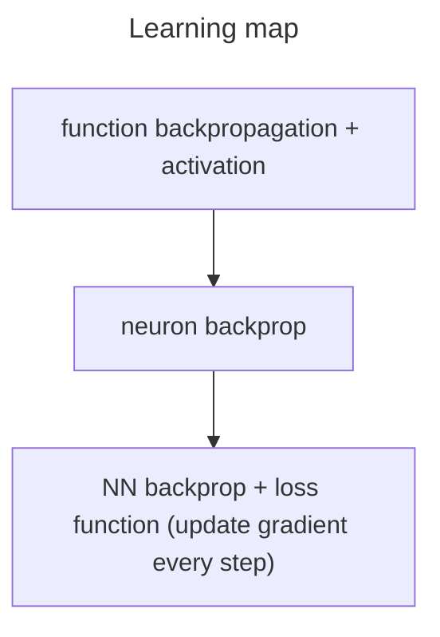

This repo contains my notes from Andrej Karpathy's lectures.

# Sequence of Lectures

0. 



## Challenges and Solutions
1. Weight initialization 
Weight initialization details is more important if your output layer has the (saturating) tanh non-linearity and an MSE error on top of it.
2. Overfitting Solutions
- Data augmentation: a fairly simple and very standard concept
- Dropout
- Large-scale optimization
    - Residual connections
    - Layer/batch normalization

## 1. bigram_model: using a simple bigram model to generate text

see notebook [here](/notebooks/bigram_model.ipynb)

- loss function: negative log likelihood
- not a good model, the names produced does not resemble "names"

## 2. a very simple NN: using a neural network to generate text
see notebook [here](/notebooks/NN.ipynb)
- We see similar results compared to first because NN is very simple

## 3. MLP
see notebook [here](/notebooks/MLP.ipynb) and [here](/notebooks/MLP_full_data.ipynb)

- lit: A Neural Probabilistic Language Model
  - 17000 vocab associated with a point in vector space (30 features eg)
  - components:
    - lookup table: C 17000 x 30
    - index of incoming word
    - input layer: 90 neurons total (30 neurons for 3 words)
    - hidden layer: arbitrary number of neurons (100 neurons)
      - hyperparameter (this term means can be as large as you want)
      - fully connected with input layer
    - tanh activation function
    - output layer (expensive layer: also fully connected with hidden layer)
    - softmax (exponentiated, normalized)
    - pluck out probability of word and compare to actual word
    - backpropagation optimization

# Part 3 video notes
see [here](/notebooks/build_makemore_batchnorm.ipynb)

## The initial loss is too high

we would expect uniform distribution of next-letter probability, i.e. log of 1/27

- the shape of the loss looks like a hockey stick
- the initial iterations are squashing down the logits

```python
W2 = torch.randn((n_hidden, vocab_size),          generator=g) * 0.01
b2 = torch.randn(vocab_size,                      generator=g) * 0
```

- Note W2 cannot be all 0!
- the multiplier = the value of the sd of W2

## Tanh

- it is a squashing function
- if the value is 1 or -1 in backpropagation, the gradient is 0 so backpropagation stops: "dead neuron"
  - neuron output is all 1 or -1
- i.e. one column completely white
- same issue with sigmoid and relu
  - alternative: leaky relu or elu
- can happen at initialization or optimization (with high learning rate)

`solution`

```python
W1 = torch.randn((n_embd * block_size, n_hidden), generator=g) * (5/3)/((n_embd * block_size)**0.5)
```

- deeper the network the more significant the problem
- the multiplication above is trying to preserve the guassian distribution of the input (i.e. keeping a small standard deviation)
  - the factor is square root of (5/3)/ (n_embd \* block_size)
  - Kaiming initialization

## Batch normalization
- based on [paper](https://arxiv.org/abs/1502.03167)
- normalize the hidden layer
```python
hpreact = embcat @ W1 #+ b1 # hidden layer pre-activation
```

1. Calculate the mean and standard deviation of the hidden layer
```python
  bnmeani = hpreact.mean(0, keepdim=True)
  bnstdi = hpreact.std(0, keepdim=True)
```
- mean: taking mean of everything in the batch (average of any neuron activation)
- std: standard deviation of the batch
- remember we only want this at initialization, not during training
2. Scale and shift! (offset with gain and bias)
- note `bngain` and `bnbias` below
```python
  hpreact = bngain * (hpreact - bnmeani) / bnstdi + bnbias
  with torch.no_grad():
    bnmean_running = 0.999 * bnmean_running + 0.001 * bnmeani
    bnstd_running = 0.999 * bnstd_running + 0.001 * bnstdi
```
